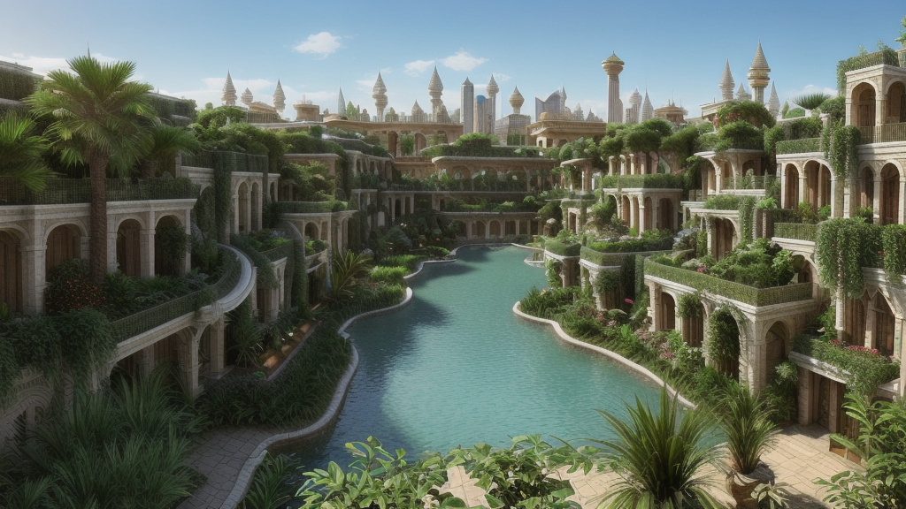

# Jardins Suspensos da Babilônia: Uma Maravilha Moderna te Espera!

Imagine um oásis verdejante em meio à selva de concreto da era moderna. Onde cascatas cristalinas serpenteiam entre terraços exuberantes adornados com flores vibrantes e árvores majestosas. Imagine um refúgio tranquilo, longe do barulho da cidade, onde você pode respirar ar puro e se conectar com a natureza.

<b> Essa visão agora é realidade nos Jardins Suspensos da Babilônia ressuscitados! </b>

Repensados para o século XXI, esses jardins lendários transcendem sua fama histórica e se transformam em um destino turístico incomparável. Mais do que uma simples atração, os Jardins Suspensos da Babilônia oferecem uma experiência multissensorial que irá te transportar para um mundo de beleza e serenidade.

<b>Caminhe pelas passarelas sinuosas</b> que serpenteiam por cada nível, admirando a rica biodiversidade da flora e fauna. <b>Descubra cachoeiras escondidas</b> que revigoram a alma e convidam à contemplação. <b>Relaxe em gazebos aconchegantes</b> enquanto aprecia a vista panorâmica da cidade, que se estende majestosamente ao horizonte.

<b>Mas os Jardins Suspensos da Babilônia não são apenas um lugar para relaxar.</b> Eles também são um centro de aprendizado e inovação, onde você pode:

<ul>
    <li><b>Participar de workshops e palestras </b>sobre sustentabilidade, agricultura urbana e tecnologias verdes.
    <li><b>Explorar museus interativos</b> que contam a história dos jardins originais e celebram o poder da engenhosidade humana.
    <li><b>Degustar pratos deliciosos</b> preparados com ingredientes frescos cultivados nos próprios jardins.
</ul>

<b>Os Jardins Suspensos da Babilônia são a escapada perfeita para quem busca:</b>

<ul>
    <li>Uma experiência única e inesquecível.
    <li>Um refúgio tranquilo em meio à agitação da cidade.
    <li>Uma oportunidade de aprender sobre sustentabilidade e tecnologias verdes.
    <li>Um momento de conexão com a natureza e consigo mesmo.
</ul>

<b>Então, o que você está esperando?</b> Reserve suas férias hoje mesmo e venha descobrir os Jardins Suspensos da Babilônia, uma maravilha moderna que te espera de braços abertos!

<b>#JardinsSuspensos #Babilônia #Viagem #Turismo #Férias #Natureza #Sustentabilidade #Inovação #Aprenda #Explore #Deguste #ConecteSe</b>